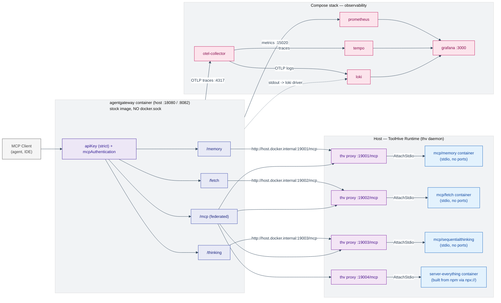
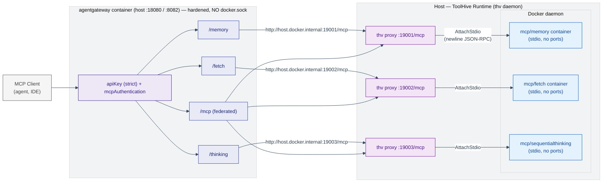

# MCP Gateway Sample — agentgateway (native stdio / ToolHive / mcpwrap)

Bridge multiple **stdio-based** MCP servers behind one unified HTTP gateway
with subpath routing, API-key authentication, tool federation, and
OpenTelemetry observability (Grafana stack). The sample ships **three
runtimes** for the same gateway config, each with its own compose file,
config, and start/stop scripts — pick one, run one at a time:

| Approach                | What runs the MCP servers                                                                                                            | Gateway is…                                                                               | Files                                                         |
| ----------------------- | ------------------------------------------------------------------------------------------------------------------------------------ | ----------------------------------------------------------------------------------------- | ------------------------------------------------------------- |
| **1. Native `stdio`**   | the **gateway itself** spawns each server as a host subprocess (`stdio: { cmd, args }`)                                              | a **host binary** (`agentgateway -f config.yaml`) — no gateway container, no custom image | `config.stdio.yaml` + `docker-compose.stdio.yml` (infra only) |
| **2. ToolHive (`thv`)** | `thv` daemon runs all **4** servers (3 official images + `everything` built on demand from npm via `npx://`), proxies stdio→HTTP     | **stock `agentgateway` container** in the compose stack                                   | `config.toolhive.yaml` + `docker-compose.toolhive.yml`        |
| **3. `mcpwrap`**        | bundled Go wrapper bridges stdio→HTTP, runs the 3 official images as plain stdio containers (**docker images only — teaching/demo**) | **stock `agentgateway` container** in the compose stack                                   | `config.mcpwrap.yaml` + `docker-compose.mcpwrap.yml`          |

The gateway (stock image or host binary), Keycloak, and the full
observability stack are the same everywhere — only the backend targets
differ. No docker.sock anywhere; the gateway never talks to Docker.

> **Which one for production?** **Approach 2 (ToolHive)** — the stock
> hardened gateway image plus real workload lifecycle (auto-restart,
> health, egress guardrails) and the only variant that can host
> npm-only servers (`npx://`/`uvx://`) like `everything`. Approach 1 is the
> most agentgateway-native zero-dependency option; `mcpwrap` (3) is kept
> as a **teaching tool** — it shows the stdio→HTTP bridge ToolHive hides,
> but it cannot host npm-only servers and has no production lifecycle.

## What it does

| Endpoint    | Backend                  | Transport                                                        |
| ----------- | ------------------------ | ---------------------------------------------------------------- |
| `/memory`   | `mcp/memory`             | host runtime proxy (stdio→HTTP)                                  |
| `/fetch`    | `mcp/fetch`              | host runtime proxy (stdio→HTTP)                                  |
| `/thinking` | `mcp/sequentialthinking` | host runtime proxy (stdio→HTTP)                                  |
| `/mcp`      | all backends multiplexed | unified (`memory_*` / `fetch_*` / `thinking_*` / `everything_*`) |

- One gateway on `http://localhost:18080` (API key) and `http://localhost:8082` (SSO), four MCP endpoints (subpaths).
- The MCP servers run as stdio processes/containers on the **host**, in one
  of three ways — see the [approach table](#mcp-gateway-sample--agentgateway-native-stdio--toolhive--mcpwrap)
  and [three approaches section](#the-three-approaches--which-runtime-should-you-use):
  (1) **native `stdio`** — the gateway **binary** forks them directly, (2)
  ToolHive's `thv` daemon (`host.docker.internal:19001-19004/mcp`, the
  production choice), or (3) the `mcpwrap` Go wrapper
  (`host.docker.internal:19101-19103/mcp`, teaching only). The gateway
  itself is the **stock official** `agentgateway` image in variants 2–3
  (no custom build, no docker CLI, no `/var/run/docker.sock` mount,
  non-root) and the **host binary** in variant 1 (no custom image at all).
- Strict API-key auth: `x-api-key: sk-alice-demo-key` (or `sk-mcp-gateway-demo-key`,
  `sk-bob-demo-key`) — Context7-style per-user keys with attribution + per-user quotas.
- Native OpenTelemetry traces (OTLP) + Prometheus metrics
  (`:15020/metrics`, incl. `agentgateway_mcp_requests_total`) + structured
  stdout logs (streamed to Loki via the Docker **loki log driver**).
- Admin UI at `http://localhost:15000/ui`.

## Multiplexing (Virtual MCP) — one endpoint, all tools

The first three routes expose one server per path; the fourth, `/mcp`,
**federates every backend** so an end-user client (agent, IDE, script)
configures a **single connection string** and sees every tool from every
MCP server. This is agentgateway's
[multiplexing / Virtual MCP](https://agentgateway.dev/docs/standalone/latest/mcp/connect/virtual/):
several **targets in one backend** produce a single unified MCP server
whose `tools/list` is the union of all targets, namespaced by target name
(`memory_*`, `fetch_*`, `thinking_*`) so identical tool names never
collide. Per the docs it is _not_ a feature of the top-level `mcp:`
section — it is a property of putting several targets in one backend, so it
works identically in `routes[].backends[].mcp` and in the `mcp:` block
(see [MCP configuration modes](https://agentgateway.dev/docs/standalone/latest/mcp/configuration-modes/)).
This sample uses **both** shapes:

- the routing-based `/mcp` route (4 targets in the stdio + ToolHive
  variants, 3 in the mcpwrap variant) on `:18080` (apiKey)
- the top-level `mcp:` block (4 targets, incl. `everything`) on the
  `sso` gateway `:8082` (Keycloak JWT)

The four stdio targets are the official reference servers from the
[modelcontextprotocol/servers](https://github.com/modelcontextprotocol/servers)
repo — [`memory`](https://github.com/modelcontextprotocol/servers/tree/main/src/memory),
[`fetch`](https://github.com/modelcontextprotocol/servers/tree/main/src/fetch),
[`sequentialthinking`](https://github.com/modelcontextprotocol/servers/tree/main/src/sequentialthinking),
and [`everything`](https://github.com/modelcontextprotocol/servers/tree/main/src/everything)
(a kitchen-sink test server exposing ~13 tools incl. `echo`). `everything`
ships as an **npm package only** — no docker image — so the native-stdio
and ToolHive variants host it via `npx`, while `mcpwrap` (docker images
only) does not. All four show up in the Admin UI under **MCP → Servers**
(`ready`), and `everything` is included in both federated `/mcp` endpoints
of the stdio + ToolHive variants.

```yaml
# config.stdio.yaml — /mcp route: FOUR targets in ONE backend
- name: multiplexing-mcp-apikey
  gateways: [default]
  matches:
    - path: { pathPrefix: /mcp }
  backends:
    - mcp:
        targets:
          - name: memory
            stdio:
              cmd: npx
              args: ["-y", "@modelcontextprotocol/server-memory"]
          - name: fetch
            stdio:
              cmd: uvx
              args: ["--with", "mcp<2", "mcp-server-fetch"]
          - name: thinking
            stdio:
              cmd: npx
              args: ["-y", "@modelcontextprotocol/server-sequential-thinking"]
          - name: everything
            stdio:
              cmd: npx
              args: ["-y", "@modelcontextprotocol/server-everything"]
```

**The client only ever configures ONE endpoint.** Verified live (stdio +
ToolHive variants — 4 targets):

| Client endpoint              | Auth                    | Tools seen (verified)                                                                                                |
| ---------------------------- | ----------------------- | -------------------------------------------------------------------------------------------------------------------- |
| `http://localhost:18080/mcp` | `x-api-key` (per user)  | 24 — memory (9) + fetch (1) + thinking (1) + everything (~13)                                                        |
| `http://localhost:8082/mcp`  | Keycloak JWT (per user) | alice 24, bob 23 — `fetch_fetch` hidden by `mcpAuthorization` (top-level `mcp:` block: 4 targets incl. `everything`) |

The mcpwrap variant (3 targets) shows 11 tools on `/mcp` — memory (9) +
fetch (1) + thinking (1), on both ports.

The Admin UI **Tool Playground** shows the same federated view (Initialize →
24 namespaced tools, callable directly). Tool names default to `conditional`
`prefixMode` — prefixed only when the backend has more than one target; see
[Tool name prefixing](https://agentgateway.dev/docs/standalone/latest/mcp/connect/virtual/#tool-name-prefixing).
Multiplexing is **not** load balancing — requests route to the right target
by name; multiple _backends_ in a route is what does load balancing
([multiplexing vs. load balancing](https://agentgateway.dev/docs/standalone/latest/mcp/connect/virtual/#about-multiplexing)).

**Multiplexing works across every transport** — targets can mix connection
methods in the same backend:

| Target type             | Docs                                                                                    | What it connects to                                                          |
| ----------------------- | --------------------------------------------------------------------------------------- | ---------------------------------------------------------------------------- |
| `stdio`                 | [connect/stdio](https://agentgateway.dev/docs/standalone/latest/mcp/connect/stdio/)     | a command the gateway spawns locally (this sample)                           |
| `mcp` (streamable HTTP) | [connect/http](https://agentgateway.dev/docs/standalone/latest/mcp/connect/http/)       | a remote MCP server over streamable HTTP (sessions pinned per request)       |
| `openapi`               | [connect/openapi](https://agentgateway.dev/docs/standalone/latest/mcp/connect/openapi/) | a REST API from an OpenAPI spec — one MCP tool per operation (`operationId`) |

## Architecture



## Prerequisites

- **Docker** (Desktop on Windows/Mac, daemon on Linux) — runs the gateway +
  Keycloak + observability stack.
- **ToolHive CLI** (`thv`) on the host — runs the MCP server containers and
  proxies their stdio to HTTP:

  ```powershell
  winget install stacklok.thv          # Windows
  # or: brew install thv                # macOS/Linux
  thv version
  ```

- **Loki docker log driver** (one-time; `scripts/start-toolhive.sh` installs
  it automatically):

  ```bash
  docker plugin install grafana/loki-docker-driver:latest --alias loki --grant-all-permissions
  ```

- **Hosts entry**: add `127.0.0.1 keycloak` (admin) so the browser OAuth
  flow can reach the advertised `http://keycloak:8080/...` endpoints.
- curl / PowerShell (for manual API calls).

## Quick start

```bash
./scripts/start-toolhive.sh   # [1] thv workloads -> [2] loki driver -> [3] compose stack
./scripts/stop-toolhive.sh    # stop everything
# Windows: run the same steps manually (PowerShell + Git Bash), see below
```

The launcher: (1) brings up the MCP servers on the host via `thv`, (2)
installs the Loki log driver if missing, and (3) runs
`docker compose -f docker-compose.toolhive.yml up -d` — the gateway,
Keycloak, and the observability stack come up automatically.

### Manual start (for reference)

```bash
# 1) MCP servers on the host (idempotent: cleans stale state, starts all three)
./scripts/start-toolhive.sh

# 2) gateway + Keycloak + observability (stock gateway image, no build)
docker compose -f docker-compose.toolhive.yml up -d

# 3) follow the gateway logs (docker loki driver pushes them to Loki too)
docker compose -f docker-compose.toolhive.yml logs -f gateway
```

## Verify

```bash
# full suite: auth rejection + tools/list on all 4 subpaths +
# e2e tool calls (memory create/read, fetch URL, sequential thinking)
# + Keycloak JWT auth on the :8082 SSO port
cd tests/McpGateway.Tests && dotnet test
```

Manual curl flavor (initialize handshake is needed before `tools/list`):

```bash
# initialize (grab the Mcp-Session-Id response header)
curl -i -X POST http://localhost:18080/memory \
  -H "x-api-key: sk-mcp-gateway-demo-key" \
  -H "content-type: application/json" \
  -H "accept: application/json, text/event-stream" \
  -d '{"jsonrpc":"2.0","id":1,"method":"initialize","params":{"protocolVersion":"2025-06-18","capabilities":{},"clientInfo":{"name":"curl","version":"1"}}}'

# tools/list with the session id
curl -s -X POST http://localhost:18080/memory \
  -H "x-api-key: sk-mcp-gateway-demo-key" \
  -H "content-type: application/json" \
  -H "accept: application/json, text/event-stream" \
  -H "mcp-session-id: <SESSION_ID>" \
  -d '{"jsonrpc":"2.0","id":2,"method":"tools/list"}'
```

## Approach 1 — native `stdio` runtime (host binary)

Everything above runs the stdio servers **behind** a bridge. Approach 1 uses
agentgateway's own `stdio` backend target — the gateway **forks the MCP
servers itself** as subprocesses and talks JSON-RPC over stdin/stdout — the
flow shown in the [agentgateway docs](https://agentgateway.dev/docs/standalone/latest/mcp/connect/stdio/).

**The gateway runs as a HOST BINARY, not a container.** `stdio` targets
spawn commands _where the gateway process runs_, and the stock gateway
container image has no Node/Python to run `npx` / `uvx`. The documented
flow is exactly what this variant does: install the binary
(`curl -sL https://agentgateway.dev/install | bash`), run
`agentgateway -f config.stdio.yaml`. **No custom gateway image** — nothing
to build, ever.

```yaml
# config.stdio.yaml — the `stdio` target is the whole runtime
backends:
  - mcp:
      targets:
        - name: memory
          stdio:
            cmd: npx
            args: ["-y", "@modelcontextprotocol/server-memory"]
        - name: fetch
          stdio:
            cmd: uvx
            args: ["--with", "mcp<2", "mcp-server-fetch"]
        - name: thinking
          stdio:
            cmd: npx
            args: ["-y", "@modelcontextprotocol/server-sequential-thinking"]
        - name: everything
          stdio:
            cmd: npx
            args: ["-y", "@modelcontextprotocol/server-everything"]
```

`docker-compose.stdio.yml` runs **Keycloak + observability only** — there is
no gateway service and no MCP-server container; the gateway process and its
four server subprocesses live on the host:

```
host:  agentgateway -f config.stdio.yaml   (:18080 apiKey, :8082 SSO, :15000 UI, :15020 metrics)
         ├─ npx @modelcontextprotocol/server-memory          (stdio subprocess)
         ├─ uvx --with "mcp<2" mcp-server-fetch                 (stdio subprocess)
         ├─ npx @modelcontextprotocol/server-sequential-thinking (stdio subprocess)
         └─ npx @modelcontextprotocol/server-everything          (stdio subprocess)
compose (docker-compose.stdio.yml): keycloak + otel-collector + prometheus + tempo + loki + grafana + langfuse + phoenix
```

```bash
./scripts/start-stdio.sh   # ensure npx + uvx -> loki driver -> compose infra -> detached host gateway
./scripts/stop-stdio.sh    # stop everything (kill gateway pid + compose down)
```

`start-stdio.sh` (1) checks Docker/npx/pip, (2) installs the `agentgateway`
binary if missing, (3) ensures the MCP server runners on the host — `npx`
(Node) and `uvx` (installed via `pip install uv` if missing); npx/uvx fetch
the server packages on demand, (4) brings up the infra compose stack, and
(5) starts the gateway **detached** (`nohup`, pid in
`logs/agentgateway-stdio.pid`) and waits for :18080.

**What changed vs the container variants** (all in `config.stdio.yaml`):

- **Ports**: the apiKey gateway binds host **18080** directly (Keycloak owns
  8080 on the host) — no 8080→18080 publish mapping needed.
- **OTLP**: `otlpEndpoint: http://localhost:4317` (the otel-collector's
  _published_ port) — a host process can't use the in-network name
  `mcp-agentgateway-otel-collector`.
- **Request-log DB**: `sqlite:///tmp/agentgateway/request-log.db` — a
  host-writable path instead of the container volume.
- **Metrics**: Prometheus scrapes the host binary via
  `extra_hosts: ["gateway:host-gateway"]` in `docker-compose.stdio.yml`.
- **Logs**: the gateway writes `logs/agentgateway-stdio.log` (no container
  log driver for a host process); Loki gets the infra containers' logs only.
- **JWKS / token issuer**: still `http://keycloak:8080/...` — the host
  resolves `keycloak` via the `127.0.0.1 keycloak` hosts entry (same
  prerequisite as the other variants).
- **UI playground**: the top-level **`mcp:` section** (the docs-style
  simplified form) lives on the **`sso` gateway `:8082`** and federates the
  same four stdio targets behind the Keycloak OAuth. The Admin UI's Tool
  Playground talks to the top-level `mcp:` listener — the first gateway in
  `mcp.gateways`, path `/mcp` — not to route-level backends, so this
  section is what makes `http://localhost:15000/ui/mcp/playground` work.
  The `cors` and `mcpAuthentication` policies inside the `mcp:` block let
  the browser reach `:8082` and validate the Bearer token (a Keycloak JWT,
  e.g. alice's).

**Pros** (summary: zero moving parts, gateway-native, tiny footprint)

- Zero extra moving parts: one binary, no host daemon, no proxies, no
  Dockerfile, no custom image.
- Fully agentgateway-native: sessions, health, and process lifecycle are all
  owned by the gateway itself.
- Smallest host footprint (no wrapper binary, no thv state, no proxy ports).

**Cons** (summary: shared fate, host prerequisites)

- **Not containerized**: every server shares the host OS — no
  `--network none`, no egress guardrails, no per-server isolation.
- A server crash can destabilize the gateway process (shared fate).
- The host must carry the runtimes (Node/npx, uv) and
  PATH must resolve `mcp-server-*` / `npx`.
- Gateway logs go to a file — no Docker log driver, no container-based
  log/metrics plumbing for the gateway itself.

**Pick this when**: you want the most agentgateway-native setup, don't mind
installing the server runtimes on the host, and the servers are trusted
(no need for container isolation).

## Alternative runtime (teaching only): the `mcpwrap` wrapper

Everything above runs the stdio servers on the host with a runtime that
bridges stdio → Streamable HTTP. The sample also ships a **second runtime
option** — [`mcpwrap/`](mcpwrap/README.md), a small Go CLI (~300 lines,
cobra-based, installable via `go install`) that does the same bridging with
**no extra runtime dependencies — just Docker and one binary**: it runs each
official image as a plain stdio container (`docker run -i --rm --name
mcpwrap-<name>`), reads newline-delimited JSON-RPC from stdout, writes
requests back into stdin, and exposes the proxy on the host as
`host.docker.internal:19101-19103/mcp`. agentgateway targets it as a plain
HTTP backend, so the routes/auth/policies are identical — only the backend
ports differ (`config.mcpwrap.yaml` vs `config.toolhive.yaml`).

> **Scope: teaching / demo only — not for production.** `mcpwrap` exists to
> make the stdio→HTTP bridge visible: you can watch the wrapper spawn each
> container, forward JSON-RPC frames, and mint sessions, which is exactly
> the machinery ToolHive hides behind `thv run`. Two hard limits:
> **docker-images-only** (it has no `npx://`/`uvx://` support, so it cannot
> host npm-only servers like `everything`) and **no lifecycle** (no
> auto-restart, no health-based recovery, no egress guardrails). Use
> ToolHive (Approach 2) for anything real.

|                      | `mcpwrap` (Go wrapper)                                |
| -------------------- | ----------------------------------------------------- |
| stdio→HTTP bridge    | built-in id-matching proxy (`/mcp`, `/healthz`)       |
| host containers      | 3 (one per server, no sidecars)                       |
| no-outbound servers  | `--no-network` (`docker run --network none`)          |
| sessions             | `Mcp-Session-Id` (minted on initialize)               |
| lifecycle            | `mcpwrap up` daemon, state in `~/.mcpwrap/state.json` |
| runtime dependencies | Docker + the ~10 MB exe (`go install` / `install.sh`) |

```bash
./scripts/start-mcpwrap.sh   # build wrapper -> mcpwrap daemon (:19101-19103) -> loki driver -> compose stack
./scripts/stop-mcpwrap.sh    # stop everything
```

The launcher builds `mcpwrap/mcpwrap.exe` (Go 1.24+), starts
`mcpwrap up -f mcpwrap/mcpwrap.json` detached (pid in `logs/mcpwrap.pid`),
waits until the three proxies answer `/healthz`, then brings up
`docker-compose.mcpwrap.yml` — the same gateway + Keycloak + observability,
with the gateway container mounted on `config.mcpwrap.yaml` (targets
`host.docker.internal:19101-19103/mcp`). `mcpwrap` requests are serialized
per workload and matched by JSON-RPC `id`.

> **Run one runtime at a time** — both stacks publish the same host ports
> (18080/8082/8080/3000/...). Switch with `./scripts/stop-toolhive.sh` /
> `./scripts/stop-mcpwrap.sh` first. The observability containers (same names
> in both files) are reused; only the gateway container and MCP-server
> runtime differ.

### The three approaches — which runtime should you use?

agentgateway talks to its backends over **streamable HTTP** (`mcp.host`
targets) **or** spawns a server itself (`stdio: { cmd, args }` — the
documented flow for stdio servers, see
[connect/stdio](https://agentgateway.dev/docs/standalone/latest/mcp/connect/stdio/)).
The choice is really: _who converts stdio ↔ HTTP, and where do the server
processes live?_ The table below is the same comparison the blog post makes;
all three approaches are implemented in this sample.

**Approach 1 — agentgateway's native `stdio` target, host binary.** The
gateway process forks `npx @modelcontextprotocol/server-memory`,
`uvx --with "mcp<2" mcp-server-fetch`,
`npx @modelcontextprotocol/server-sequential-thinking`, and
`npx @modelcontextprotocol/server-everything` on the host and speaks
JSON-RPC over stdin/stdout — **no bridge, no extra daemon, no custom image**
(`stdio` targets run _where the gateway runs_; the stock gateway container
has no Node/Python, so the gateway must be the **host binary**:
`agentgateway -f config.yaml`). Implemented in this sample:
`config.stdio.yaml` + `docker-compose.stdio.yml` (infra only) +
`scripts/start-stdio.sh`.

|                                                                  | **1. native `stdio` (host binary)**                                 | **2. ToolHive (`thv`)** — recommended                               | **3. `mcpwrap` (Go wrapper, teaching)**  |
| ---------------------------------------------------------------- | ------------------------------------------------------------------- | ------------------------------------------------------------------- | ---------------------------------------- |
| Gateway                                                          | host binary, no container                                           | stock image container                                               | stock image container                    |
| Extra runtime to install                                         | none (binary only)                                                  | `thv` CLI                                                           | ~10 MB Go exe                            |
| Server processes                                                 | subprocesses of the gateway                                         | 4 containers (fetch + egress + DNS sidecars; everything via npx://) | 3 stdio containers (no sidecars)         |
| stdio→HTTP bridge                                                | none — native fork                                                  | built-in proxy                                                      | built-in proxy                           |
| Container isolation                                              | **none** (all share host OS)                                        | egress Squid + DNS sidecars for untrusted servers                   | `--network none` for no-outbound servers |
| Server lifecycle                                                 | gateway-managed (restart = gateway restart)                         | auto-restart, health, crash backoff                                 | `mcpwrap up` daemon, no auto-restart     |
| Server crash impact                                              | can destabilize the gateway process                                 | isolated (separate containers)                                      | isolated (separate containers)           |
| No-outbound hardening                                            | none (no container boundary at all)                                 | `--isolate-network=false`                                           | `--network none`                         |
| Host prerequisites                                               | Node/npx + uv                                                       | Docker                                                              | Docker                                   |
| Logs / metrics                                                   | file log, no container log driver                                   | container logs → Loki driver                                        | container logs → Loki driver             |
| Can host npm-only servers (`npx://`/`uvx://`, e.g. `everything`) | ✅ (npx on host)                                                    | ✅ (`npx://` scheme builds a container on demand)                   | ❌ docker images only                    |
| Best for                                                         | zero-dependency demo, single-host, full agentgateway-native control | **production default** — fleet mgmt, lifecycle, untrusted servers   | demo / teaching the stdio→HTTP bridge    |

**Preferred with agentgateway:**

- **Approach 2 (ToolHive) is the production default.** It keeps the
  hardened **stock-image gateway**, isolates every server in its own
  container, adds real workload lifecycle (auto-restart, health, backoff)
  and egress guardrails (Squid/DNS sidecars), and — uniquely — hosts
  npm-only servers (`everything`) via its `npx://`/`uvx://` protocol
  schemes ([run MCP servers with ToolHive](https://docs.stacklok.com/toolhive/guides-cli/run-mcp-servers)).
  The cost: more containers and a heavier host runtime.
- **Approach 1 (native `stdio`)** is the _most_ agentgateway-native: no
  extra runtime, the gateway owns the server processes and their
  sessions/health, and it needs only a host binary — no custom Dockerfile.
  The cost: zero container isolation (every server shares the host OS, a
  crash can take the gateway with it) and you must install the server
  runtimes (Python/Node) on the host.
- **Approach 3 (`mcpwrap`)** is a **teaching tool**: it demonstrates the
  stdio→HTTP bridge with nothing but Docker + a small binary, but it is
  docker-images-only and has no production lifecycle.
- **No bridge at all** whenever the server already speaks HTTP — point
  `mcp.host` straight at it and skip all three.

### How to host any MCP server (packaging → choice)

The deciding question is **how the MCP server is packaged**. The matrix:

| Server packaging                                             | Approach 1 (stdio)                      | Approach 2 (ToolHive)                                      | Approach 3 (mcpwrap)              | Notes                                                           |
| ------------------------------------------------------------ | --------------------------------------- | ---------------------------------------------------------- | --------------------------------- | --------------------------------------------------------------- |
| Docker image (`mcp/memory`, `mcp/fetch`, …)                  | ✅ (npx/uvx wrapper if also on npm)     | ✅ `thv run docker.io/mcp/fetch`                           | ✅ `docker run -i --rm`           | all three can run official images                               |
| npm package only (`@modelcontextprotocol/server-everything`) | ✅ `cmd: npx, args: [-y, …]`            | ✅ `thv run npx://@modelcontextprotocol/server-everything` | ❌ (no npx:// support)            | the `everything` server in this sample: mcpwrap cannot host it  |
| PyPI/uvx package (`mcp-server-fetch`)                        | ✅ `cmd: uvx, args: [--with, mcp<2, …]` | ✅ `thv run uvx://…`                                       | ❌                                | fetch is packaged as a docker image too, so all three work here |
| Remote URL (already streamable HTTP)                         | ✅ (if node/python available, else no)  | ✅ `thv run https://…`                                     | ✅ (only if HTTP-capable wrapper) | best done with **no bridge**: `mcp.host` straight to the URL    |
| Already-HTTP server (in-cluster)                             | n/a                                     | n/a                                                        | n/a                               | **skip the bridge** — `mcp.host: http://server/mcp` direct      |

The short rule: **docker image or npm-only → ToolHive (or native stdio on
a host with the runtimes); already-HTTP → `mcp.host` directly; teaching a
bridge → mcpwrap.**

## API-key auth (Context7-style, port 18080)

The `default` gateway on `:18080` uses **per-user API keys** — the same
pattern [Context7](https://context7.com) uses: every key maps to exactly one
user, so requests are attributable, quotable, and revocable per user. No
browser flow, no token expiry — the key _is_ the credential.

```yaml
gateways:
  default:
    port: 8080
    apiKey:
      mode: strict # reject requests without a key
      location:
        header:
          name: x-api-key # pinned to the x-api-key header
      keys:
        - key: sk-mcp-gateway-demo-key # shared automation key -> mcpuser
          metadata: { user: mcpuser, role: admin }
        - key: sk-alice-demo-key # one key per developer
          metadata: { user: alice, role: dev }
        - key: sk-bob-demo-key
          metadata: { user: bob, role: dev }
```

What the metadata buys you:

- **Attribution** — `config.standardAttributes.user` maps the key metadata
  into the per-request identity: `has(jwt.preferred_username) ?
jwt.preferred_username : apiKey.user` resolves to `alice|bob|mcpuser` for
  key-based traffic. That identity lands in the **request-log database**
  (`agentgateway_user` column, queryable from the Admin UI at
  `http://localhost:15000/ui` or any SQLite client). Note: in the current
  gateway image the SQLite writer does not checkpoint (`0` committed rows),
  so attribution is best observed on the SSO port, where `mcpAuthentication`
  also enriches spans with `jwt.*` claims. The identity claim is still fully
  available to route-level CEL policies (see quotas below) regardless.
- **Per-user quotas** — `localRateLimit.conditional` keyed on `apiKey.user`
  (same mechanism as the SSO routes, but for API-key identities):

  ```yaml
  localRateLimit:
    conditional:
      - condition: 'apiKey.user == "alice"'
        maxTokens: 60
        tokensPerFill: 60
        fillInterval: 1m
      - condition: 'apiKey.user == "bob"'
        maxTokens: 30
        tokensPerFill: 30
        fillInterval: 1m
  ```

- **Revocation** — delete the key from the list (or rotate it); no client
  session to kill, no token to expire. Hot-reloads with the config.

```bash
# call through :18080 with a per-user key
curl -i -X POST http://localhost:18080/memory \
  -H "x-api-key: sk-alice-demo-key" \
  -H "content-type: application/json" \
  -H "accept: application/json, text/event-stream" \
  -d '{"jsonrpc":"2.0","id":1,"method":"initialize","params":{"protocolVersion":"2025-06-18","capabilities":{},"clientInfo":{"name":"curl","version":"1"}}}'
```

**API key vs OAuth — when to use which:**

|                       | API key (Context7-style)                        | `mcpAuthentication` (Keycloak OAuth)                     |
| --------------------- | ----------------------------------------------- | -------------------------------------------------------- |
| Credential            | Static per-user secret (`x-api-key`)            | Short-lived JWT + refresh (browser login)                |
| Identity              | From key metadata (`apiKey.user`)               | From JWT claims (`jwt.preferred_username`)               |
| Expiry                | None (until revoked)                            | Access token + session expiry, refresh flow              |
| Rotation / revocation | Delete key from config                          | Disable user in Keycloak                                 |
| Browser UX            | None (caller sends the key)                     | Popup login, PKCE, silent refresh                        |
| Best for              | Scripts, CI, MCP clients that can hold a secret | Human developers, Copilot `oauth` block, per-user scopes |

Both can coexist on the same routes (different gateways/ports), and both feed
the same downstream CEL policies (`localRateLimit`, logs, traces) — the
only difference is which identity claim the rules read.

## SSO: Keycloak OAuth 2.1 / MCP-spec (port 8082)

The gateway exposes **two authenticated entry ports** for the same routes:

| Port  | Auth                                                         | Credential                                                        |
| ----- | ------------------------------------------------------------ | ----------------------------------------------------------------- |
| 18080 | API key (`x-api-key`, strict) — Context7-style per-user keys | `sk-alice-demo-key`, `sk-bob-demo-key`, `sk-mcp-gateway-demo-key` |
| 8082  | `mcpAuthentication` (`mode: strict`) — OAuth 2.1 bearer JWT  | Keycloak-issued access token (per-user)                           |

`config.toolhive.yaml` defines a second gateway named `sso` that carries
**no gateway-level auth at all**. Each of its four routes attaches the
route-level `mcpAuthentication` policy (`mode: strict`) — the **MCP
Authorization spec**-style resource-server protection — which replaces the
old gateway-level `jwtAuth` approach entirely:

- **Validation**: every request needs a `Authorization: Bearer` JWT issued
  by the realm's issuer (`http://keycloak:8080/realms/mcp-demo`, audience
  `mcp-gateway`), verified with the **JWKS by URL** (Keycloak's live
  `/protocol/openid-connect/certs` — no more static JWKS file).
- **OAuth discovery**: `GET /.well-known/oauth-protected-resource/memory`
  and `GET /.well-known/oauth-authorization-server/memory` are public
  (200); the AS metadata is proxied from Keycloak and advertises the
  `registration_endpoint`.
- **Dynamic client registration (DCR)**: because `mcpAuthentication` sets
  `clientId: mcp-gateway`, the gateway short-circuits
  `POST /.well-known/oauth-authorization-server/memory/client-registration`
  with a mock `201` (`client_id: mcp-gateway`, `token_endpoint_auth_method:
none` → PKCE-only public client). No Keycloak initial-access token needed.
- **Per-user authorization**: the route-level `mcpAuthorization.rules` CEL
  uses `jwt.preferred_username` (Keycloak's `sub` is a random UUID, so the
  login name is the usable claim):
  - `/memory` → alice **and** bob (9 tools each)
  - `/fetch` → alice only (bob gets `[]` / 403)
  - `/thinking` → alice or bob
  - `/mcp` → alice all 11 tools; bob 10 (no `fetch_fetch`)
- **Per-user quotas**: route-level `localRateLimit` keyed on
  `jwt.preferred_username` (alice 60 req/min, bob 30 req/min — verified:
  bob's 40 rapid requests → 29×200 + 11×429 `rate limit exceeded`).
- **Attribution**: every request log and trace span carries `jwt.sub`
  (Keycloak user UUID); `config.standardAttributes.user` synthesizes
  `agentgateway_user` = `preferred_username` (falling back to `apiKey.user`)
  for logs/metrics/traces.

Keycloak runs in the compose stack (`quay.io/keycloak/keycloak:26.0`, realm
imported from `keycloak/realm-export.json` on first boot):

| Item             | Value                                                             |
| ---------------- | ----------------------------------------------------------------- |
| Keycloak console | http://localhost:8081 (admin / admin)                             |
| Realm            | `mcp-demo` (issuer `http://keycloak:8080/realms/mcp-demo` in-net) |
| Client           | `mcp-gateway` (**public**, PKCE — no secret)                      |
| Demo users       | `alice`/`alice123`, `bob`/`bob123`, `mcpuser`/`mcpuser123`        |

> The realm's `frontendUrl` is `http://keycloak:8080` so every minted token
> carries that in-network issuer — the gateway (running in the same Docker
> network) can always resolve it. **Required**: add `127.0.0.1 keycloak` to
> your hosts file (admin) so the browser flow can reach the advertised
> `http://keycloak:8080/...` endpoints (auth, token, JWKS) — Keycloak owns
> host port 8080 precisely for this (`docker-compose.toolhive.yml`), while
> the gateway's apiKey port lives on 18080.

Mint a token and call the MCP gateway through the SSO port (no API key!):

```bash
# 1) mint a Keycloak access token (password grant; public client → no secret)
TOKEN=$(curl -s -X POST http://localhost:8081/realms/mcp-demo/protocol/openid-connect/token \
  -d 'grant_type=password' -d 'client_id=mcp-gateway' \
  -d 'username=alice' -d 'password=alice123' | jq -r .access_token)

# 2) MCP initialize through :8082 with the Keycloak JWT
curl -i -X POST http://localhost:8082/memory \
  -H "Authorization: Bearer $TOKEN" \
  -H "content-type: application/json" \
  -H "accept: application/json, text/event-stream" \
  -d '{"jsonrpc":"2.0","id":1,"method":"initialize","params":{"protocolVersion":"2025-06-18","capabilities":{},"clientInfo":{"name":"curl","version":"1"}}}'

# 3) OAuth discovery + DCR are public (no token needed)
curl -s http://localhost:8082/.well-known/oauth-protected-resource/memory
curl -s http://localhost:8082/.well-known/oauth-authorization-server/memory
curl -s -X POST http://localhost:8082/.well-known/oauth-authorization-server/memory/client-registration \
  -H "content-type: application/json" \
  -d '{"redirect_uris":["http://127.0.0.1:33418"],"grant_types":["authorization_code"]}'
# → 201 {"client_id":"mcp-gateway","token_endpoint_auth_method":"none",...}
```

> **How it works**: the old `jwtAuth` gateway policy (static JWKS file,
> single shared audience) is gone. `mcpAuthentication` is the docs-
> recommended route-level policy: it enforces the MCP auth spec — strict
> bearer validation, public OAuth metadata endpoints, and a DCR
> short-circuit — and it populates `jwt.*` claims for downstream CEL
> policies (`mcpAuthorization`, `localRateLimit`, logs, traces) without any
> extra auth policy. Discovery paths are public; everything else returns
> `401` (`reason: JwtAuth`) without a valid token.

### Authenticating your MCPs with Keycloak (`mcpAuthentication`)

Full reference: [MCP authentication — agentgateway docs](https://agentgateway.dev/docs/standalone/latest/configuration/security/mcp-authn/)

**Concept.** `mcpAuthentication` turns the gateway into an **OAuth 2.0
resource server** for MCP traffic, implementing the [MCP Authorization
specification](https://modelcontextprotocol.io/specification/draft/basic/authorization).
It is configured **per route** under `policies.mcpAuthentication`, and uses a
**connect-time model**: the OAuth flow happens once when the client first
connects, then the access token is reused for every request in the session.
Because it runs at the route level, the validated JWT claims (`jwt.*`) are
available to every other route-level policy — authorization, rate limiting,
logging, tracing.

**Deployment scenario.** The docs describe three scenarios; this sample uses
**Authorization Server Proxy** with the `keycloak` provider:

- The gateway **exposes protected-resource metadata** on behalf of the MCP
  server (`/.well-known/oauth-protected-resource/<path>`).
- It **proxies Keycloak's authorization-server metadata** and dynamic client
  registration (`/.well-known/oauth-authorization-server/<path>`).
- It **validates bearer tokens with Keycloak's live JWKS** and returns
  `401` + `WWW-Authenticate` for unauthenticated requests.

The route must also **match the well-known paths** so the policy can serve
that metadata — that is why every SSO route lists four `matches`:

```yaml
matches:
  - path: { pathPrefix: /memory } # the MCP endpoint
  - path: { exact: /.well-known/oauth-protected-resource/memory } # resource metadata
  - path: { exact: /.well-known/oauth-authorization-server/memory } # AS metadata (proxied)
  - path: {
        exact: /.well-known/oauth-authorization-server/memory/client-registration,
      } # DCR
```

**Field reference** (as used in this sample, mapped to Keycloak):

| Field               | Sample value                                                                                                | What it does                                                                                                                                                                                                                         |
| ------------------- | ----------------------------------------------------------------------------------------------------------- | ------------------------------------------------------------------------------------------------------------------------------------------------------------------------------------------------------------------------------------ |
| `mode`              | `strict`                                                                                                    | `strict` (default): no valid token → 401. `optional`: token validated if present, no token allowed. `permissive`: never rejects on auth                                                                                              |
| `issuer`            | `http://keycloak:8080/realms/mcp-demo`                                                                      | Keycloak realm URL. Must match the `iss` claim and be resolvable from the gateway container (in-network `keycloak:8080`)                                                                                                             |
| `audiences`         | `[mcp-gateway]`                                                                                             | Required audience in the token (`aud` claim — the Keycloak client)                                                                                                                                                                   |
| `jwks.url`          | `http://keycloak:8080/realms/mcp-demo/protocol/openid-connect/certs`                                        | Live JWKS — no static key file, keys rotate transparently                                                                                                                                                                            |
| `provider.keycloak` | `{}`                                                                                                        | Adapts the proxy to Keycloak's non-standard endpoints (e.g. certs location)                                                                                                                                                          |
| `clientId`          | `mcp-gateway`                                                                                               | Because Keycloak DCR needs an initial-access token, the gateway **short-circuits** `client-registration` with a mock `201` (`token_endpoint_auth_method: none` → PKCE-only public client). Required for VS Code Copilot to bootstrap |
| `resourceMetadata`  | `resource: http://localhost:8082/memory`, `scopesSupported: [read:all]`, `bearerMethodsSupported: [header]` | What the gateway advertises in protected-resource metadata (drives client scope requests, e.g. Copilot sends `scope=read:all`)                                                                                                       |

**Keycloak side** (all in `keycloak/realm-export.json`):

- Realm `mcp-demo`; `attributes.frontendUrl = http://keycloak:8080` so every
  minted token carries the in-network issuer the gateway resolves.
- Client `mcp-gateway`: **public** (`publicClient: true`), `standardFlowEnabled`
  (browser auth-code + PKCE), `directAccessGrantsEnabled` (password grant for
  testing), `redirectUris` include `http://127.0.0.1:33418` **and**
  `http://127.0.0.1:33418/` (VS Code's callback — Keycloak matches redirect
  URIs exactly).
- A **`read:all` client scope** assigned as a **default scope** on the client
  (Keycloak rejects unknown scopes with `Invalid scopes` otherwise), with
  `include.in.token.scope: true` so tokens carry `scope: read:all`.

### Per-user tool authorization (`mcpAuthorization`)

Full reference: [MCP authorization — agentgateway docs](https://agentgateway.dev/docs/standalone/latest/configuration/security/mcp-authz/)

`mcpAuthorization` is the **AuthZ** half. Instead of running against HTTP
requests, it runs against **MCP method invocations** (`tools/list`,
`tools/call`, prompts, resources). A denied tool is **automatically filtered
from the `list` response** — the client never even sees it (verified: bob's
`/fetch` returns `[]`, and `/mcp` hides `fetch_fetch`).

```yaml
mcpAuthorization:
  rules:
    - 'jwt.preferred_username == "alice"' # rule 1
    - 'jwt.preferred_username == "bob"' # rule 2 (rules are OR-ed)
```

**CEL variables available at request time:**

| Variable                                | Meaning                                                                                          |
| --------------------------------------- | ------------------------------------------------------------------------------------------------ |
| `jwt.<claim>`                           | Claims from the Keycloak token validated by `mcpAuthentication` (no separate auth policy needed) |
| `mcp.tool.name`                         | The tool being called (e.g. `fetch`)                                                             |
| `mcp.tool.target`                       | The backend target handling the call (e.g. `memory`)                                             |
| `mcp.prompt.name` / `mcp.resource.name` | Prompt/resource access                                                                           |

> ⚠️ **`mcp.tool.arguments` is _not_ available during authorization** — it is
> populated only after a tool call completes (access logs only). Decide on
> `mcp.tool.name` / `mcp.tool.target` instead.

**Why `jwt.preferred_username` and not `jwt.sub`:** Keycloak's `sub` claim is
a random UUID (`67c405a7-...`), not the login name. The login name lives in
`preferred_username` — so per-user rules key off that. Decode any token
(`jwt.io` or the admin console) before writing claim rules.

**Common patterns** (all used in this sample):

```yaml
# grant a whole route to specific users (OR-ed)
rules:
  - 'jwt.preferred_username == "alice"'
  - 'jwt.preferred_username == "bob"'

# tool-level rules with target backend
rules:
  - 'jwt.preferred_username == "bob" && mcp.tool.target != "fetch"'  # bob: everything but fetch

# any authenticated user
rules:
  - 'jwt.preferred_username.startsWith("mcp")'
```

You can try CEL expressions in the **CEL playground** in the admin UI
(`http://localhost:15000/ui`) before putting them in the config.

### Onboarding your own MCP server with Keycloak auth

To protect a new MCP backend the same way (e.g. add `mcp/my-server`):

1. **Keycloak**: no new client needed (reuse `mcp-gateway`); create a user
   for each human (`admin console → Realm mcp-demo → Users`).
2. **Gateway route**: add a route on the `sso` gateway with the four
   `matches` (path + the three well-known paths), `backends.mcp.targets`
   pointing at your server, and `policies.cors` + `mcpAuthentication` (same
   issuer/audience/JWKS, `resourceMetadata.resource` =
   `http://localhost:8082/<your-path>`).
3. **AuthZ**: add `mcpAuthorization.rules` keyed on `jwt.preferred_username`
   (or tool names) — denied tools disappear from `tools/list` automatically.
4. **Quotas** (optional): `localRateLimit.conditional` on
   `jwt.preferred_username` for per-user buckets.
5. **Test**: mint a token with `scripts/get-mcp-token.sh alice`, then
   `initialize` + `tools/list` on `http://localhost:8082/<your-path>`.
6. **VS Code**: add `{ "type": "http", "url": "http://localhost:8082/<your-path>", "oauth": { "clientId": "mcp-gateway" } }` to `.vscode/mcp.json` — Copilot bootstraps discovery → DCR → browser login automatically.

### VS Code Copilot via Keycloak (OAuth browser flow)

VS Code's MCP config (`mcp.json`) supports a native `oauth` block: Copilot
bootstraps itself through discovery → DCR → browser login. The sample's
`.vscode/mcp.json` uses it — **no manual token minting needed**:

```jsonc
{
  "servers": {
    "memory": {
      "type": "http",
      "url": "http://localhost:8082/memory",
      "oauth": { "clientId": "mcp-gateway" },
    },
    "fetch": {
      "type": "http",
      "url": "http://localhost:8082/fetch",
      "oauth": { "clientId": "mcp-gateway" },
    },
    "thinking": {
      "type": "http",
      "url": "http://localhost:8082/thinking",
      "oauth": { "clientId": "mcp-gateway" },
    },
    "gateway-all": {
      "type": "http",
      "url": "http://localhost:8082/mcp",
      "oauth": { "clientId": "mcp-gateway" },
      "enabled": false,
    },
  },
}
```

What happens when you add the server:

1. Copilot reads `/.well-known/oauth-protected-resource/memory` and
   `/.well-known/oauth-authorization-server/memory` (public).
2. It calls the advertised `registration_endpoint` — the gateway answers
   with the **mock 201** (`client_id: mcp-gateway`, PKCE-only).
3. A browser popup opens at Keycloak's authorization endpoint
   (`http://keycloak:8080/.../auth`, `code_challenge=S256`); you log in as
   alice/bob and are redirected back to VS Code (`http://127.0.0.1:33418`).
4. Copilot exchanges the code (with `code_verifier`) at Keycloak's token
   endpoint and stores the access + refresh tokens; it auto-refreshes
   before expiry.

Prereqs: **`127.0.0.1 keycloak` in your hosts file** (so the advertised
`http://keycloak:8080/...` endpoints resolve from the host), and the Keycloak
client's `redirectUris` include `http://127.0.0.1:33418` and
`https://vscode.dev/redirect` (already set in `keycloak/realm-export.json`).

Per-user security properties (unchanged from the JWT design):

- **Audit**: request logs and traces carry `jwt.sub` +
  `agentgateway_user` (`preferred_username`) — every call is attributable.
- **Revocation**: disable the user in Keycloak (or set a short access-token
  lifespan) — new logins stop; refresh tokens die with the session.
- **Token hygiene**: Copilot refreshes silently; no env var, no manual
  re-minting, no committed secrets.
- **Per-user policies**: authorization rules and rate limits key off
  `preferred_username`, so alice/bob get different tool sets and quotas
  through the same gateway.

## Observability (Grafana stack)

| Service         | Port  | Notes                                                                                                |
| --------------- | ----- | ---------------------------------------------------------------------------------------------------- |
| agentgateway UI | 15000 | admin UI, MCP playground                                                                             |
| agentgateway    | 18080 | apiKey gateway (routes `/memory`, `/fetch`, `/thinking`, `/mcp`)                                     |
| agentgateway    | 8082  | SSO gateway — Keycloak-protected routes **and** the top-level `mcp:` virtual server (`/mcp`, `/sse`) |
| agentgateway    | 15020 | native Prometheus `/metrics` endpoint                                                                |
| agentgateway    | 15021 | readiness probe                                                                                      |
| otel-collector  | 4317  | OTLP gRPC (traces from gateway)                                                                      |
| prometheus      | 9090  | scrapes gateway + collector                                                                          |
| tempo           | 3200  | trace backend                                                                                        |
| loki            | 3100  | log backend (OTLP ingest on `/otlp`)                                                                 |
| grafana         | 3000  | `admin` / `admin`, provisioned datasources + MCP dashboard                                           |
| langfuse        | 3001  | LLM observability UI (self-hosted v3, OTLP ingest)                                                   |
| phoenix         | 6006  | LLM observability UI (Arize Phoenix, OTLP gRPC ingest)                                               |
| keycloak        | 8081  | OIDC IdP (realm `mcp-demo`, admin/admin)                                                             |

### LLM observability: Langfuse + Arize Phoenix

On top of the Grafana stack, the collector fans traces out to **two LLM
observability backends** (see `otel-collector.yaml`):

- **Langfuse** (http://localhost:3001) — self-hosted v3 (the smallest
  OTLP-capable version: web + worker + postgres + redis + clickhouse +
  minio). Headless init auto-creates the `agentgateway-demo` project with
  `pk-lf-demo-public-key` / `sk-lf-demo-secret-key` — the same keys the
  collector uses for Basic auth on `/api/public/otel/v1/traces`.
- **Arize Phoenix** (http://localhost:6006) — single container with embedded
  SQLite; the collector exports OTLP gRPC to `phoenix:4317`. Auth is
  disabled (`PHOENIX_ENABLE_AUTH=false`) so traces are visible immediately.

> **Caveat**: this sample routes only `mcp:` backends, so the spans carry
> gateway/MCP attributes (`mcp.method.name`, `mcp.target`, `http.path`, …)
> but **no `gen_ai.*` LLM spans** — those require `ai:` backends (LLM
> providers). Langfuse/Phoenix show the gateway + MCP trace data here, not
> LLM generations.

Checklist:

1. **Traces** — Grafana → Explore → Tempo: search `call_tool` (or any MCP
   method); inspect the span attributes (`mcp.method.name`, `mcp.target`,
   `gen_ai.tool.name`).
2. **Metrics** — dashboard **MCP Gateway — agentgateway** (folder `MCP`):
   request rate, per-server, per-method panels driven by
   `agentgateway_mcp_requests_total`. Or Prometheus → http://localhost:9090
   → query `agentgateway_mcp_requests_total`.
3. **Logs** — Grafana → Explore → Loki: query
   `{container_name="mcp-agentgateway-gateway-toolhive"}` (gateway stdout,
   pushed by the Docker **loki log driver**; labels `container_name`,
   `job="agentgateway"`); each request logs `mcp.method.name` /
   `mcp.target` / `trace.id`. In the **native stdio variant** the gateway is
   a host process — its logs go to `logs/agentgateway-stdio.log` instead
   (the loki driver still collects the infra containers' logs).

## Security notes

- The API key is enforced at the **gateway** level, so it protects all four
  MCP routes (and would protect LLM/UI traffic if attached to this gateway).
- **UI playground (native stdio variant)**: the Admin UI's Tool Playground
  connects to the **top-level `mcp:` section**, not to per-route
  `backends[].mcp` targets. In `config.stdio.yaml` that section lives on
  the **`sso` gateway `:8082`** and serves a virtual MCP server (`/mcp` +
  `/sse`) federating the same four stdio targets behind Keycloak OAuth. To
  verify access to tools: open
  `http://localhost:15000/ui/mcp/playground`, click **Apply CORS** if
  prompted, expand **Authorization header** and paste a **Keycloak JWT**
  (mint one with `curl -s -X POST
http://localhost:8081/realms/mcp-demo/protocol/openid-connect/token -d
"grant_type=password&client_id=mcp-gateway&username=alice&password=alice123"`,
  then take the `access_token`), then click **Initialize** — the gateway
  lists all 24 federated tools and you can call them (e.g.
  `everything_echo`) directly from the UI. The `cors` + `mcpAuthentication`
  policies inside the `mcp:` block let the browser reach `:8082` and
  validate the JWT (strict mode would otherwise 401 the CORS preflight).
  The per-route backends on `:18080`/`:8082` remain the primary API for
  programmatic clients; the top-level `mcp:` section is the docs-style
  simplified form that the UI understands.
- **The gateway container has zero Docker privileges**: stock official
  image, read-only rootfs, `cap_drop: ALL`, `no-new-privileges`, non-root
  (uid 65532), and **no `/var/run/docker.sock` mount** — the MCP servers
  run on the host under ToolHive, so the gateway never spawns containers.
  Still treat it as a network service: don't expose port 18080 to untrusted
  networks, and keep the API key secret.
- The host-side ToolHive proxies bind `0.0.0.0` (`--host 0.0.0.0`) so the
  gateway container can reach them via `host.docker.internal` — in
  production secure them (firewall / `--allowed-origins` / mTLS).
- `randomSampling: true` captures every trace — for production lower it to a
  ratio (e.g. `"0.1"`).

### Which authentication should you use for MCPs?

**Recommended:** `mcpAuthentication` (strict) + `mcpAuthorization` +
per-user rate limits, backed by Keycloak — i.e. exactly what this sample's
`sso` gateway `:8082` already runs:

- **Why:** it implements the [MCP authorization
  spec](https://modelcontextprotocol.io/specification/draft/basic/authorization)
  — what real MCP clients (2025-03-26 protocol, IDE integrations, agents)
  natively expect: OAuth discovery (`/.well-known/oauth-authorization-server`),
  dynamic client registration, the `resource` param (RFC 8707), PKCE, and
  standard `401` + `WWW-Authenticate` challenges.
- **Identity > keys:** real users, expiry, revocation, federated IdP. An API
  key can't express "alice logged in via corporate SSO".
- **Per-tool authz:** CEL rules filter denied tools from the client's view
  entirely — bob never even sees `fetch`.
- **API keys:** fine as a quick start / internal service-to-service fallback
  (simplest, zero infra), or alongside SSO for machine clients that can't do
  OAuth. That's why the sample keeps both on separate gateways (`:18080`
  apiKey, `:8082` SSO) — a good pattern.
- **Stacking (what this sample demonstrates end-to-end):** Keycloak as IdP →
  `mcpAuthentication` (authn) → `mcpAuthorization` (authz) → `localRateLimit`
  (quota) → OTel traces with `standardAttributes.user`. All four mechanisms
  live-verified.

## Troubleshooting

- **Gateway can't reach the MCP servers / HTTP 500 `Connection refused` on
  :8082 or :18080**: the ToolHive proxies are host processes — if the
  terminal that spawned them closed (or after a reboot) they died while the
  containers stayed up. Fix: `./scripts/start-toolhive.sh` (idempotent).
- **`thv run` fails with "workload already exists"**: stale runconfig from
  a killed proxy. `start-toolhive.sh` cleans it (`thv rm` + removes the
  runconfig/status JSON + `docker rm -f`).
- **MCP server image not pulled yet**: `thv run` pulls `mcp/memory`,
  `mcp/fetch`, `mcp/sequentialthinking` on first start. Pulls may take a
  few seconds — retry the request.
- **No gateway logs in Loki**: the gateway container uses the Docker **loki
  log driver** (installed by `scripts/start-toolhive.sh`); verify the plugin
  is present (`docker plugin ls`) and Loki is up
  (`docker compose -f docker-compose.toolhive.yml logs -f loki`).
- **No metrics in Prometheus**: confirm `http://localhost:15020/metrics`
  responds; Prometheus scrapes `gateway:15020` on the compose network.
- **Config errors**: `docker compose -f docker-compose.toolhive.yml run --rm gateway agentgateway -f /config.yaml --validate-only`.
- **Native stdio variant — gateway not on PATH / MCP servers not found**:
  `start-stdio.sh` installs the `agentgateway` binary and ensures `npx` +
  `uvx`, but the gateway spawns them from **its own PATH**. If `npx`/
  `uvx` aren't on the gateway's PATH (e.g. installed into a user dir),
  re-login or export the dir, then re-run `./scripts/start-stdio.sh`. Check
  the
  gateway log: `tail -30 logs/agentgateway-stdio.log`.
- **Native stdio variant — gateway won't start**: the host process binds
  :18080/:8082/:15000/:15020 directly. If something else owns one of those
  ports, `start-stdio.sh` fails — stop the other variant first
  (`./scripts/stop-mcpwrap.sh` / `stop-toolhive.sh`).
- **Native stdio variant — sqlite path**: the config uses
  `sqlite:///tmp/agentgateway/request-log.db` (host-writable); on Windows
  adjust `config.stdio.yaml` to a writable path.
- **Collector crash-loops with "bind: address already in use" on 8888**: on
  Docker Desktop the port forwarder can hold 8888 even though the host port
  is free. The collector's prometheus exporter therefore listens on
  **8889** (see `otel-collector.yaml` + the `otel-collector` scrape target
  in `prometheus.yml`).
- **Memory graph state**: the memory server persists its graph in a named
  volume owned by ToolHive. Reset the demo graph with
  `./scripts/stop-toolhive.sh`, then
  `docker volume ls | grep -i memory` and `docker volume rm <volume>`.
- **Gateway crash-loops with `failed to connect sqlite database`**: the
  stock gateway image does **not** create `/var/log/agentgateway`, so a
  fresh `gateway-logs` volume is root-owned and the non-root gateway (uid 65532) can't write its request-log DB. `scripts/start-*.sh` pre-create and
  `chown` that volume to 65532 (and `keycloak-data` to 1000) before
  `compose up` — don't delete those volumes by hand, or re-run the start
  script after `docker volume rm`.
- **Keycloak shows `unhealthy`**: Keycloak 26 serves `/health/ready` on its
  **management** interface (port 9000), not on 8080 — the compose
  healthcheck already targets `localhost:9000`. If you run an older Keycloak
  image, revert that check to 8080.
- **SSO port returns 401 `token uses the unknown key`**: the gateway caches
  Keycloak's JWKS; if Keycloak was recreated with a new signing key (e.g.
  its data volume was removed), force the gateway to refetch:
  `docker compose -f docker-compose.mcpwrap.yml up -d --force-recreate gateway`.
  The compose files keep Keycloak's signing keys in the persistent
  `keycloak-data` volume precisely so this can't happen on a normal
  `down`/`up` cycle.
- **UI shows "legacy MCP backend" in Traffic → Routes**: cosmetic label,
  hardcoded in the admin UI (`ui/src/traffic.ts`) for any route whose
  backend is `mcp:` — i.e. the **routing-based** config mode. It is _not_ a
  deprecation: the [configuration-modes docs](https://agentgateway.dev/docs/standalone/latest/mcp/configuration-modes/)
  state the top-level `mcp:` section and `routes[].backends[].mcp` are two
  forms of the **same** MCP backend. The label can't be removed for
  route-level backends; it disappears only if you migrate to the top-level
  `mcp:` section (then routes show under **MCP → Servers** instead) — at
  the cost of one shared endpoint/policy set per gateway instead of
  separate per-path routes with per-port auth, which is why this sample
  keeps the routing-based form for `/memory`, `/fetch`, `/thinking` and
  uses the top-level `mcp:` section only for the federated `:8082/mcp`
  that the Tool Playground talks to.

## Deployment model — ToolHive Runtime

The sample runs the MCP servers on the **host** via ToolHive's `thv` daemon
and routes to their HTTP proxies; the gateway container holds **zero** Docker
privileges (no docker.sock, no docker CLI — stock official image). The four
endpoints (`/memory`, `/fetch`, `/thinking`, `/mcp`) expose the same
API-key + Keycloak OAuth protection; only the backend `mcp.host` targets
point at the ToolHive proxies.

### ToolHive Runtime (`docker-compose.toolhive.yml` + `config.toolhive.yaml`)

Instead of writing our own bridge, we use [ToolHive](https://toolhive.dev/)
(Stacklok, Apache-2.0) — a Docker-based MCP runtime whose CLI (`thv run`)
pulls **any official container image** and automatically proxies its stdio
transport to a Streamable HTTP endpoint on the host. No custom bridge code,
no Dockerfiles per server, and — critically — **no docker.sock anywhere in
the gateway stack**: the `thv` daemon owns Docker on the host and handles
pull, deploy, health monitoring, and auto-restart. agentgateway just routes
to the proxies as plain `mcp.host` HTTP targets.



### How one container hosts a stdio server

Official MCP images like `mcp/fetch` expose **no HTTP port** — they speak
stdio: newline-delimited JSON-RPC over stdin/stdout. ToolHive makes them
servable over HTTP without touching the image, by splitting the work across
two processes (see ToolHive's [Transport Architecture](https://github.com/stacklok/toolhive/blob/main/docs/arch/03-transport-architecture.md)):

1. **Container** — runs the stock image with stdin attached
   (`AttachStdin`/`AttachStdout`, `OpenStdin=true`) and **zero port
   bindings**. ToolHive injects `MCP_TRANSPORT=stdio`.
2. **Proxy (host process)** — a separate `thv` process owns the HTTP port
   (`:19002`). For stdio it is a _protocol-specific proxy_: it reads
   JSON-RPC from the container's stdout, writes requests back into its
   stdin, and frames messages as newline-delimited JSON-RPC — see
   [Container Attach (Stdio Transport)](https://github.com/stacklok/toolhive/blob/main/docs/arch/03-transport-architecture.md#container-attach-stdio-transport).

That's why `--transport stdio` is mandatory: without it ToolHive assumes the
image self-hosts HTTP (`streamable-http` + `FASTMCP_PORT`), never attaches
stdin, and the stdio-only server exits immediately (restart loop, proxy
502). `--proxy-mode streamable-http` only selects the HTTP shape clients
speak — the container never sees it.

### Containers per workload: default isolation vs `--isolate-network=false`

By default (`--isolate-network=true`, see the [`thv run` CLI docs](https://github.com/stacklok/toolhive/blob/main/docs/cli/thv_run.md))
ToolHive puts every workload on its own internal bridge network and adds two
sidecars — `*-egress` (Squid forward proxy) and `*-dns` (dnsmasq) — that
enforce the permission profile's outbound allowlist and DNS controls
([RunConfig and Permission Profiles](https://github.com/stacklok/toolhive/blob/main/docs/arch/05-runconfig-and-permissions.md)).
That is **3 containers per workload**, even for servers that never touch the
network.

Isolation governs only **outbound** traffic — it has nothing to do with
serving HTTP, and the stdio bridge above works identically with it off. So
our rule:

> **Use `--isolate-network=false` whenever the server needs no outbound
> network.** You lose only the egress ACL + DNS guardrails, which matter
> only for network-touching servers.

`mcp/fetch` fetches arbitrary URLs → keep isolation (3 containers).
`mcp/memory` and `mcp/sequentialthinking` make no outbound calls → drop it
(1 container each). Total **5 containers** instead of 9 — same routes, same
auth, verified end-to-end below.

**Prereq** — ToolHive CLI (`thv`) on the host:

```powershell
winget install stacklok.thv          # Windows
# or: brew install thv                # macOS/Linux
thv version
```

**Step 1 — run the servers on the host.** The one-liner (recommended) —
idempotent: cleans stale state, starts all three workloads, verifies:

```bash
./scripts/start-toolhive.sh
```

Under the hood it runs exactly these `thv run` commands (one per server;
each pulls the official docker.io image and starts a host-side HTTP proxy;
the server container itself gets no port binding — stdio only):

```powershell
# fetch MUST reach the internet -> keep ToolHive's default network isolation
# (on by default): 3 containers = fetch + fetch-egress (Squid ACL proxy) +
# fetch-dns (dnsmasq). Egress proxy whitelists hosts/ports; DNS sidecar
# blocks private/internal targets (SSRF + DNS-rebinding protection).
thv run docker.io/mcp/fetch              --host 0.0.0.0 --proxy-port 19002 --transport stdio --proxy-mode streamable-http
# memory + sequentialthinking make no outbound calls -> --isolate-network=false:
# 1 container each, no egress/dns sidecars.
thv run docker.io/mcp/memory             --host 0.0.0.0 --proxy-port 19001 --transport stdio --proxy-mode streamable-http --isolate-network=false
thv run docker.io/mcp/sequentialthinking --host 0.0.0.0 --proxy-port 19003 --transport stdio --proxy-mode streamable-http --isolate-network=false
```

> **Run the script after every reboot / terminal close.** The thv proxies are
> host processes; if the terminal that spawned them closes, they die and the
> gateway answers `Connection refused` on `:8082/*` (HTTP 500 upstream). The
> containers and gateway stay up — only the proxies vanish. `start-toolhive.sh`
> cleans the stale state and brings them back without touching the gateway.

> **Container math.** ToolHive's default network isolation
> (`--isolate-network true`) adds egress (Squid) + DNS (dnsmasq) sidecars
> per workload — see [RunConfig and Permission Profiles](https://github.com/stacklok/toolhive/blob/main/docs/arch/05-runconfig-and-permissions.md).
> `mcp/fetch` is an untrusted image that fetches arbitrary URLs, so it
> keeps the guardrails (3 containers). `mcp/memory` and
> `mcp/sequentialthinking` never open outbound connections, so we default
> to `--isolate-network=false` for them (1 container each) — see the
> container-math subsection above. Total **5 host containers** instead of 9.
>
> **`--transport stdio --proxy-mode streamable-http` is required** — see
> the bridge explanation above. Without `--transport stdio`, ToolHive
> assumes the container self-serves HTTP, never attaches stdin, and the
> stdio-only server exits immediately (exit 0 → restart loop → proxy 502).
> `--network none` does **not** work either: the proxy cannot reach the
> container's stdio bridge at all.
>
> `--host 127.0.0.1` (the default) binds the proxy loopback-only, which is
> unreachable from the gateway container — hence `--host 0.0.0.0`. That turns
> the proxy ports into plain host network services: in production secure them
> (firewall / `--allowed-origins` / mTLS) or run the gateway with host
> networking instead. `thv list` shows the running workloads.

**Step 2 — start the gateway stack** (single compose file: stock gateway +
Keycloak + observability — no build step, no docker.sock):

```powershell
docker compose -f docker-compose.toolhive.yml up -d
```

`config.toolhive.yaml` defines the routes/auth; the backend targets point at
the ToolHive proxies:

```yaml
backends:
  - mcp:
      targets:
        - name: memory
          mcp:
            host: http://host.docker.internal:19001/mcp
```

**Verified end-to-end** (this session): gateway → ToolHive proxy → official
container —

- `POST :18080/memory` (apiKey) → `initialize` 200, `serverInfo.name:
memory-server` **v0.6.3** (the real docker.io image — not a bridge),
  9 memory tools; `create_entities` wrote + read back an entity.
- `:18080/fetch` → `fetch` tool; `:18080/thinking` → `sequentialthinking`.
- `:18080/mcp` → federated 11 tools (`memory_*` / `fetch_*` /
  `thinking_*`).
- `:8082/memory` (Keycloak JWT as alice) → 200, 9 tools.
- `thv list` → all three workloads `running` with their proxy URLs: 5
  host containers total (`fetch` + `fetch-egress` + `fetch-dns`; `memory`
  and `sequentialthinking` run `--isolate-network=false`, 1 container each).

**Why ToolHive?** The `thv` daemon owns Docker on the host and handles
per-workload lifecycle (pull, deploy, health monitoring, backoff-retry,
auto-restart on container exit), so the gateway stack keeps **zero** Docker
privileges and no bridge code to maintain. ToolHive's separate _vMCP_
gateway layer (OIDC + Cedar + federation) is intentionally **not** used here
— agentgateway already provides API keys, quotas, OAuth, and federation, so
we keep it as the single gateway and borrow only ToolHive's runtime.

**When to pick `mcpwrap` instead?** Same gateway, same routes, same auth —
but a lighter host runtime: no extra runtime dependency to install
(`go install` or `mcpwrap/install.sh`), 3 containers total (no sidecars),
and ~300 lines of readable Go that show exactly what the stdio→HTTP bridge
does. It trades away auto-restart and network-isolation sidecars for
simplicity — fine for a demo, a teaching tool, or a locked-down host.
See ["The three approaches"](#the-three-approaches--which-runtime-should-you-use)
above for the full decision — including when you need no bridge at all
(HTTP-native servers) or agentgateway's own native `stdio` target.

**Files:**

```
config.stdio.yaml           # Approach 1 (native stdio): routes/auth, targets = `stdio: { cmd, args }` (host binary)
config.mcpwrap.yaml         # Approach 3: same routes/auth, targets = mcpwrap proxies (host.docker.internal:19101-19103/mcp)
config.toolhive.yaml        # Approach 2: same routes/auth, targets = ToolHive proxies (host.docker.internal:19001-19004/mcp)
docker-compose.stdio.yml    # INFRA ONLY (Approach 1): keycloak + otel + prometheus + tempo + loki + grafana + langfuse + phoenix — NO gateway service
docker-compose.toolhive.yml # FULL stack (Approach 2): stock gateway + keycloak + observability
docker-compose.mcpwrap.yml  # FULL stack (Approach 3): same, gateway mounted on config.mcpwrap.yaml
scripts/start-stdio.sh      # Approach 1: install binary+packages -> loki driver -> compose infra -> detached host gateway
scripts/stop-stdio.sh       # Approach 1: kill host gateway pid + compose down
scripts/start-toolhive.sh   # Approach 2: thv workloads + loki driver + compose stack
scripts/stop-toolhive.sh    # Approach 2: stop everything
scripts/start-mcpwrap.sh    # Approach 3: build wrapper + daemon + loki driver + compose stack
scripts/stop-mcpwrap.sh     # Approach 3: stop everything
mcpwrap/                    # the mcpwrap Go wrapper (README, source, mcpwrap.json fleet config)
```

## Files

```
config.stdio.yaml             # Approach 1 (native stdio): gateway definition (routes/auth, `stdio:` targets, host-binary)
config.mcpwrap.yaml           # Approach 3: same gateway definition, mcpwrap proxy targets (:19101-19103)
config.toolhive.yaml          # Approach 2: same gateway definition, ToolHive proxy targets :19001-19004
docker-compose.stdio.yml      # Approach 1 infra only (keycloak + observability — NO gateway service, host binary instead)
docker-compose.toolhive.yml   # Approach 2 single full stack: gateway (stock image) + keycloak + otel-collector + prometheus + tempo + loki + grafana + langfuse + phoenix
docker-compose.mcpwrap.yml    # Approach 3 same stack: gateway container mounted on config.mcpwrap.yaml
otel-collector.yaml           # OTLP receivers, tempo/loki/langfuse/phoenix exporters (no filelog leg — gateway logs go via the loki docker driver)
clickhouse-keeper.xml         # embedded ClickHouse Keeper (Langfuse needs ReplicatedMergeTree)
keycloak/                     # realm-export.json (realm mcp-demo, client mcp-gateway, users alice/bob/mcpuser)
prometheus.yml                # scrape gateway:15020 + collector:8889
tempo.yaml                    # Tempo local backend config
loki-config.yaml              # Loki single-binary config
grafana/provisioning/         # datasources (prometheus/tempo/loki) + dashboard provider
grafana/dashboards/           # MCP gateway dashboard JSON
scripts/                      # start/stop-stdio.sh (Approach 1), start/stop-toolhive.sh (Approach 2), start/stop-mcpwrap.sh (Approach 3), get-mcp-token.sh
mcpwrap/                      # Go wrapper: source, README, mcpwrap.json fleet config (memory/fetch/sequentialthinking, ports 19101-19103)
tests/McpGateway.Tests/       # xUnit v3 + Shouldly verification suite (dotnet test)
```
