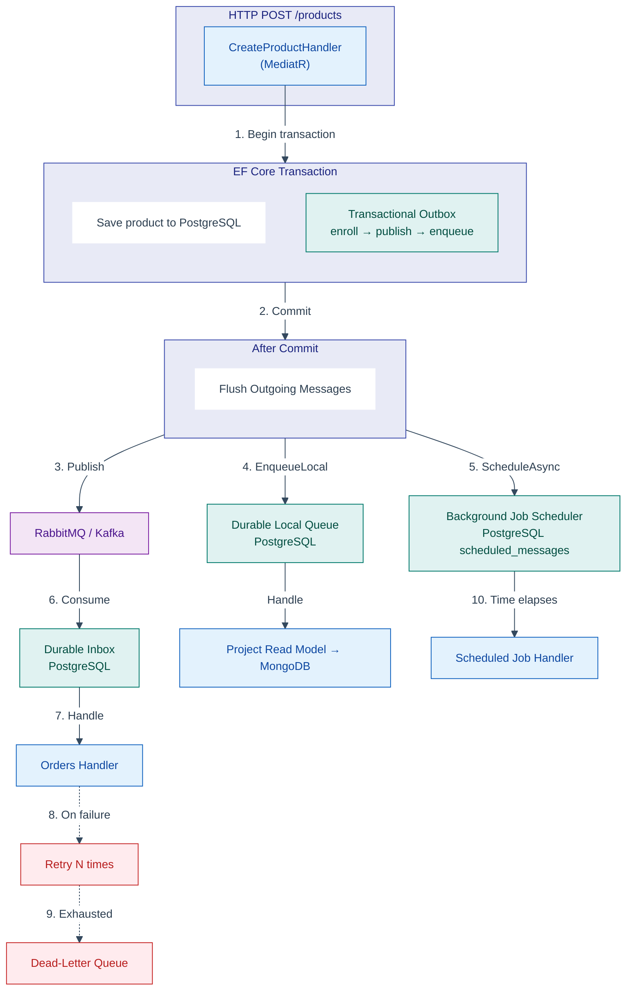
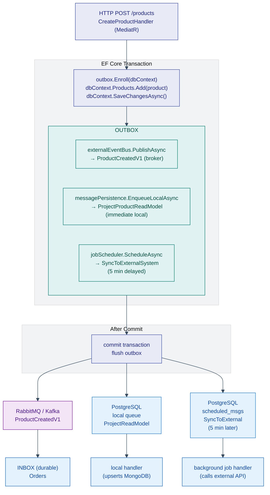

# Wolverine Transactional Messaging with Aspire

This sample shows how to build a small e-commerce system with Wolverine, .NET Aspire, PostgreSQL, MongoDB, and a selectable RabbitMQ or Kafka transport.

The solution keeps the structure intentionally close to a larger microservices codebase, but trims the building blocks down to the pieces this sample actually uses:

- two microservices: `Catalogs` and `Orders`
- shared contracts and a reusable `MessageEnvelope<T>`
- building blocks only for Wolverine, PostgreSQL, and MongoDB
- durable outbox, durable inbox, and durable local processing
- shared test data plus focused unit, startup, and vertical-slice integration tests

## What the sample demonstrates

`Catalogs` is the write-side service.

- It stores products in PostgreSQL.
- It publishes `ProductCreatedV1` through Wolverine.
- It sends an internal durable command to project a MongoDB read model after commit.

`Orders` is the downstream consumer.

- It listens to the same event from RabbitMQ or Kafka.
- It uses Wolverine durable inbox semantics backed by PostgreSQL.
- It writes an imported product record to its own PostgreSQL database.

## Messaging patterns in this sample

Wolverine supports five distinct messaging patterns out of the box, all backed by PostgreSQL durability. This sample uses four of them and documents the fifth for extension. The table below summarises each pattern, what it does, and where to see it running.

| Pattern                       | Wolverine built-in?          | DB table                                 | Timing                                | Sample location                                                                                                                                                                                                                                                                                                                                                                                                                                                                                                                                                                                                                                                                                                                                 |
| ----------------------------- | ---------------------------- | ---------------------------------------- | ------------------------------------- | ----------------------------------------------------------------------------------------------------------------------------------------------------------------------------------------------------------------------------------------------------------------------------------------------------------------------------------------------------------------------------------------------------------------------------------------------------------------------------------------------------------------------------------------------------------------------------------------------------------------------------------------------------------------------------------------------------------------------------------------------- |
| **Transactional Outbox**      | ✅ Yes                       | `wolverine_outgoing_messages`            | After commit, to broker               | [`CreateProduct.cs`](https://github.com/mehdihadeli/blog-samples/blob/main/wolverine-transactional-messaging-aspire/src/Services/Catalogs/ECommerce.Services.Catalogs/Products/Features/CreatingProduct/v1/CreateProduct.cs)                                                                                                                                                                                                                                                                                                                                                                                                                                                                                                                    |
| **Durable Inbox**             | ✅ Yes                       | `wolverine_incoming_messages`            | Before handler, from broker           | [`ProductCreatedHandler.cs`](https://github.com/mehdihadeli/blog-samples/blob/main/wolverine-transactional-messaging-aspire/src/Services/Orders/ECommerce.Services.Orders/Products/Features/ConsumingProductCreated/v1/ProductCreatedHandler.cs)                                                                                                                                                                                                                                                                                                                                                                                                                                                                                                |
| **Durable Local Queue**       | ✅ Yes                       | `wolverine_outgoing_messages`            | Immediate, local handler              | [`EnqueueLocalAsync`](https://github.com/mehdihadeli/blog-samples/blob/main/wolverine-transactional-messaging-aspire/src/BuildingBlocks/BuildingBlocks.Core/Messages/MessagePersistenceServiceExtensions.cs) → [`ProjectProductReadModelHandler.cs`](https://github.com/mehdihadeli/blog-samples/blob/main/wolverine-transactional-messaging-aspire/src/Services/Catalogs/ECommerce.Services.Catalogs/Products/Features/ProjectingProductReadModel/v1/ProjectProductReadModelHandler.cs)                                                                                                                                                                                                                                                |
| **Background Job Scheduler**  | ✅ Yes (`IMessageScheduler`) | `wolverine_scheduled_messages`           | Delayed (`TimeSpan`/`DateTimeOffset`) | [`IBackgroundJobScheduler`](https://github.com/mehdihadeli/blog-samples/blob/main/wolverine-transactional-messaging-aspire/src/BuildingBlocks/BuildingBlocks.Core/Messages/IBackgroundJobScheduler.cs) → [`CreateProduct.cs`](https://github.com/mehdihadeli/blog-samples/blob/main/wolverine-transactional-messaging-aspire/src/Services/Catalogs/ECommerce.Services.Catalogs/Products/Features/CreatingProduct/v1/CreateProduct.cs) (ScheduleAsync) → [`SyncProductToExternalSystemHandler.cs`](https://github.com/mehdihadeli/blog-samples/blob/main/wolverine-transactional-messaging-aspire/src/Services/Catalogs/ECommerce.Services.Catalogs/Products/Features/SyncProductToExternalSystem/SyncProductToExternalSystemHandler.cs) |
| **Retry + Dead-Letter Queue** | ✅ Yes                       | Broker DLQ or `wolverine_error_messages` | After max retries exhausted           | [`WolverineHostBuilderExtensions.cs`](https://github.com/mehdihadeli/blog-samples/blob/main/wolverine-transactional-messaging-aspire/src/BuildingBlocks/BuildingBlocks.Integration.Wolverine/Extensions/WolverineHostBuilderExtensions.cs) (retry policy) + [`WolverineBusOptions.cs`](https://github.com/mehdihadeli/blog-samples/blob/main/wolverine-transactional-messaging-aspire/src/BuildingBlocks/BuildingBlocks.Integration.Wolverine/Configuration/WolverineBusOptions.cs) (`UseNativeDeadLetterQueue` / `DeadLetterQueueName`)                                                                                                                                                                                                        |

### 1. Transactional Outbox

The outbox guarantees at-least-once delivery to the broker without two-phase commits. The handler writes the domain data and the outgoing message inside a single EF Core transaction. Wolverine stores the message in its PostgreSQL outbox table (`wolverine_outgoing_messages`). After the transaction commits, Wolverine flushes the pending messages to the configured broker. If the process crashes after the transaction commits but before the broker acknowledges delivery, Wolverine retries the flush on the next startup.

```csharp
// CreateProduct.cs — transactional outbox in action
outbox.Enroll(dbContext);
dbContext.Products.Add(product);
await dbContext.SaveChangesAsync(cancellationToken);

await externalEventBus.PublishAsync(
    new ProductCreatedV1(product.Id, product.Code, product.Name, product.Price, product.CreatedAtUtc),
    cancellationToken
);

await transaction.CommitAsync(cancellationToken);
await outbox.FlushOutgoingMessagesAsync();
```

**Wolverine docs:** [Durable messaging](https://wolverinefx.io/guide/durability/) · [EF Core transactional middleware](https://wolverinefx.io/guide/durability/efcore)

**Key behaviour:** if the transaction rolls back, the outgoing message rolls back with it. No orphan events. No manual cleanup.

### 2. Durable Inbox

The inbox guarantees exactly-once processing on the consumer side. When a broker message arrives, Wolverine stores it in `wolverine_incoming_messages` before acknowledging the broker. The handler processes the stored message. If the broker redelivers (because the ack was delayed), Wolverine detects the duplicate via the message ID and skips it.

Enabled in the sample for the `Orders` service:

```csharp
options.Policies.UseDurableInboxOnAllListeners();
```

**Wolverine docs:** [Durable messaging](https://wolverinefx.io/guide/durability/)

**Key behaviour:** without this, a broker redelivery during a transient handler failure would process the same event twice (at-least-once). With this, the handler is idempotent by default.

### 3. Durable Local Queue (Internal Command Processor)

Not every post-commit task needs a broker. The durable local queue lets you enqueue work that executes inside the same process, persisted in PostgreSQL so it survives restarts. This sample uses it for the MongoDB read-model projection after a product is created.

The abstraction is `IMessagePersistenceService.EnqueueLocalAsync`:

```csharp
await messagePersistence.EnqueueLocalAsync(
    new ProjectProductReadModel(
        product.Id, product.Code, product.Name, product.Price, product.CreatedAtUtc
    ),
    cancellationToken
);
```

The handler is a static Wolverine method that Wolverine discovers at startup:

```csharp
public static Task Handle(
    ProjectProductReadModel command,
    IProductReadRepository repository,
    CancellationToken cancellationToken
)
{
    return repository.UpsertAsync(
        new ProductReadModel(command.ProductId, command.Code, command.Name,
            command.Price, command.CreatedAtUtc, DateTime.UtcNow),
        cancellationToken
    );
}
```

**Wolverine docs:** [Durable local queues](https://wolverinefx.io/guide/durability/durable-local-queues)

**Key behaviour:** the local queue is **immediate** — the command executes as soon as the transaction commits and the outbox flushes. It is not delayed or scheduled.

### 4. Durable Background Job Scheduler

Some work needs to happen later, not immediately. Wolverine's `IMessageScheduler` stores scheduled message entries in `wolverine_scheduled_messages` — a PostgreSQL table created automatically by `PersistMessagesWithPostgresql`. A background **scheduling agent** polls this table every 10 seconds (configurable via `ScheduledJob.PollingInterval`) and dispatches due entries to the same handler pipeline as any other message — same handler discovery, same retry policy, same DLQ behaviour.

Because the entries live in PostgreSQL, scheduled work **survives process restarts**. On startup, Wolverine's durability agent checks for overdue entries and dispatches those too. The schedule entry is also **transactional** — if the handler that scheduled it participates in an outbox transaction and that transaction rolls back, the schedule entry never reaches the database.

The abstraction wraps Wolverine's `IMessageScheduler`:

```csharp
public interface IBackgroundJobScheduler
{
    ValueTask ScheduleAsync<T>(T message, DateTimeOffset scheduledTime, CancellationToken ct = default)
        where T : class, IMessage;

    ValueTask ScheduleAsync<T>(T message, TimeSpan delay, CancellationToken ct = default)
        where T : class, IMessage;
}
```

**Inside a handler — scheduling with transactionality:**

```csharp
await jobScheduler.ScheduleAsync(
    new SyncProductToExternalSystem(product.Id),
    TimeSpan.FromMinutes(5),
    cancellationToken
);
```

**Schedule to a specific endpoint (`ScheduleSendAsync`):**

Wolverine also provides `ScheduleSendAsync` to route the scheduled message to a named transport endpoint instead of a local handler:

```csharp
await scheduler.ScheduleSendAsync(
    new ProductAuditEvent(productId, changedBy),
    TimeSpan.FromHours(1),
    "audit-queue"
);
```

**Scheduling agent configuration:**

```csharp
options.ScheduledJob.PollingInterval = 5.Seconds();      // check every 5s instead of 10s
options.ScheduledJob.FirstExecution = 2.Seconds();       // stagger initial poll after startup
```

**Key behaviours:**

- **No extra NuGet package.** `IMessageScheduler` is built into `WolverineFx.PostgreSQL` — same package already referenced for outbox and inbox durability. The `wolverine_scheduled_messages` table is auto-created when you call `PersistMessagesWithPostgresql()`.
- **Same retry + DLQ** as all other patterns — one global policy governs everything.
- **Survives restart.** Overdue entries are dispatched on startup by the durability agent.
- **Not recurring.** One-shot only. For cron-style recurring jobs use `WolverineFx.Quartz` (optional, out of scope).

**Distinction from `EnqueueLocalAsync`:**

| Aspect           | `EnqueueLocalAsync`                   | `ScheduleAsync`                    |
| ---------------- | ------------------------------------- | ---------------------------------- |
| When             | Right after commit                    | After configured delay             |
| DB table         | `wolverine_outgoing_messages` (local) | `wolverine_scheduled_messages`     |
| Trigger          | Outbox flush                          | Scheduling agent (polls every 10s) |
| Retry + DLQ      | Global policy                         | Same global policy                 |
| Survives restart | ✅                                    | ✅                                 |

**Wolverine docs:** [IMessageScheduler](https://wolverinefx.io/guide/messaging/scheduling) · [Scheduled job configuration](https://wolverinefx.io/guide/messaging/scheduling)

### 5. Retry + Dead-Letter Queue

When any handler throws, Wolverine retries according to the configured policy, then moves the failed message to an error queue.

The sample configures a global policy:

```csharp
if (commonOptions.Bus.Retry is { MaximumAttempts: > 0 })
{
    var immediateRetries = commonOptions.Bus.Retry.MaximumAttempts - 1;
    if (immediateRetries > 0)
    {
        options
            .OnException<Exception>()
            .RetryTimes(immediateRetries)
            .Then.MoveToErrorQueue();
    }
    else
    {
        options.OnException<Exception>().MoveToErrorQueue();
    }
}
```

The dead-letter destination is transport-specific:

- **RabbitMQ:** native dead-letter exchange + queue (configured via `DeadLetterQueueName`).
- **Kafka:** native dead-letter topic (enabled via `EnableNativeDeadLetterQueue()`).
- **Fallback:** Wolverine's PostgreSQL error table (`wolverine_error_messages`).

**Wolverine docs:** [Error handling](https://wolverinefx.io/guide/handlers/error-handling) · [RabbitMQ dead letter](https://wolverinefx.io/guide/messaging/transports/rabbitmq/deadletterqueues) · [Kafka native DLQ](https://wolverinefx.io/guide/messaging/transports/kafka)

**Key behaviour:** retry and DLQ apply to **all** the patterns above — outbox publishing, inbox processing, local queue commands, and scheduled jobs. One policy governs everything.

### How the patterns compose



### When to use each pattern

| You want to...                                           | Use this pattern                                    | Why not the other                                            |
| -------------------------------------------------------- | --------------------------------------------------- | ------------------------------------------------------------ |
| Publish an event to a broker after the DB write succeeds | **Outbox** + `PublishAsync`                         | Inbox is for consumers; local queue doesn't reach the broker |
| Ensure a broker message is processed exactly once        | **Inbox** (`UseDurableInboxOnAllListeners`)         | Without it, redelivery causes duplicate processing           |
| Run a task in-process after the transaction commits      | **Durable Local Queue** (`EnqueueLocalAsync`)       | `ScheduleAsync` adds an unnecessary delay                    |
| Run a task at a specific time or after a delay           | **Background Job Scheduler** (`ScheduleAsync`)      | `EnqueueLocalAsync` runs immediately, no delay               |
| Handle transient failures (DB deadlock, network timeout) | **Retry policy** (`OnException<T>().RetryTimes(N)`) | Without it, the first failure drops the message forever      |
| Inspect or replay messages that failed permanently       | **Dead-Letter Queue** (`MoveToErrorQueue()`)        | Without it, permanently failed messages are lost             |

## Comparison table — patterns and our abstractions

| Pattern                              | When                       | Storage                                 | Wolverine built-in?          | Our abstraction                                    |
| ------------------------------------ | -------------------------- | --------------------------------------- | ---------------------------- | -------------------------------------------------- |
| **Outbox**                           | Publish after commit       | `wolverine_outgoing_messages`           | ✅ Yes                       | `IExternalEventBus` + `IMessagePersistenceService` |
| **Inbox**                            | Receive before process     | `wolverine_incoming_messages`           | ✅ Yes                       | Transparent — Wolverine handles it                 |
| **Internal Command (durable local)** | Immediate post-commit work | `wolverine_outgoing_messages` (local)   | ✅ Yes                       | `IMessagePersistenceService.EnqueueLocalAsync`     |
| **Background Job Scheduler**         | Delayed / scheduled work   | `wolverine_scheduled_messages`          | ✅ Yes (`IMessageScheduler`) | `IBackgroundJobScheduler`                          |
| **Retry + DLQ**                      | Failure handling           | Broker DLQ / `wolverine_error_messages` | ✅ Yes                       | Global policy in config                            |

## How the patterns relate



## Key distinction: Internal Command vs Background Job

| Aspect                    | `EnqueueLocalAsync`                    | `ScheduleAsync`                                 |
| ------------------------- | -------------------------------------- | ----------------------------------------------- |
| **When**                  | Right after commit (immediate)         | After a delay (configurable)                    |
| **DB table**              | `wolverine_outgoing_messages`          | `wolverine_scheduled_messages`                  |
| **Use case**              | MongoDB projection, cache invalidation | Email after 24h, sync after 5min, expiry checks |
| **Same durability?**      | Yes — survives crash + retry           | Yes — survives crash + retry                    |
| **Same handler pattern?** | Yes — static Wolverine handler         | Yes — same static handler pattern               |
| **Same retry / DLQ?**     | Yes — global policy                    | Yes — global policy                             |

Both are "background processors" from the app's perspective. The difference is timing: **immediate** vs **scheduled**. Wolverine uses a different DB table (`wolverine_scheduled_messages`) because scheduled messages need to be checked periodically (every 10s by default) rather than flushed immediately.

## Solution layout

- `src/Aspire/ECommerce.AppHost`: Aspire orchestration for PostgreSQL, MongoDB, RabbitMQ, and Kafka.
- `src/BuildingBlocks/BuildingBlocks.Integration.Wolverine*`: reusable Wolverine event bus, durable persistence, and broker transport configuration.
- `src/BuildingBlocks/BuildingBlocks.Persistence.EfCore.Postgres`: PostgreSQL `DbContext` registration helper.
- `src/BuildingBlocks/BuildingBlocks.Persistence.Mongo`: MongoDB registration helper.
- `src/Services/Catalogs`: write-side service plus MongoDB read-model projection.
- `src/Services/Orders`: consumer service with durable inbox processing.
- `src/Services/Shared`: integration events, internal commands, and transport constants.
- `src/BuildingBlocks/BuildingBlocks.Core/Messages`: envelope interfaces (`IMessageEnvelope`, `MessageEnvelope<T>`, `MessageEnvelopeMetadata`).
- `tests/Shared/Tests.Shared`: common test fixtures and transport-aware integration test base classes.
- `tests/Services/Catalogs`: startup coverage plus feature tests that mirror the `Catalogs` slices.
- `tests/Services/Orders`: startup coverage plus feature tests that mirror the `Orders` slices.

## Message flow

1. `Catalogs` receives `POST /api/v1/catalogs/products`.
2. The service opens an EF Core transaction and enrolls Wolverine's outbox in the same `DbContext`.
3. The product write model is stored in PostgreSQL.
4. `Catalogs` publishes `MessageEnvelope<ProductCreatedV1>` to RabbitMQ or Kafka.
5. `Catalogs` also sends `ProjectProductReadModel` to a durable local Wolverine queue.
6. After the transaction commits, Wolverine flushes durable outgoing work.
7. The local handler upserts the MongoDB read model.
8. `Orders` consumes `ProductCreatedV1` with durable inbox protection and writes an imported product record.

## Transport selection

Supported transports:

- `rabbitmq`
- `kafka`

Default transport in both APIs is `rabbitmq`.

The AppHost reads `Messaging__Transport`, provisions only the selected broker, and forwards the same value to both services.

Git Bash example:

```bash
cd /d/blog-writing/samples/wolverine-transactional-messaging-aspire
Messaging__Transport=kafka dotnet run --project src/Aspire/ECommerce.AppHost/ECommerce.AppHost.csproj
```

Use `rabbitmq` instead of `kafka` to switch back.

If you run the APIs directly instead of through Aspire, set `Messaging:Transport` in both API project `appsettings.json` files.

## Useful endpoints

Catalogs base path: `/api/v1/catalogs`

- `POST /products`
- `GET /products/{id}`
- `GET /products/read-model`
- `GET /products/read-model/{id}`

Orders base path: `/api/v1/orders`

- `GET /products`
- `GET /products/{id}`

When running with Aspire, use the base URLs shown in the Aspire dashboard for `catalogs-api` and `orders-api`.

## Validation

Build the full sample:

```bash
dotnet build wolverine-transactional-messaging-aspire.slnx
```

Run all tests:

```bash
dotnet test wolverine-transactional-messaging-aspire.slnx --no-build
```

The current test suite covers:

- envelope metadata creation
- MongoDB read-model projection handler behavior
- downstream consumer upsert behavior
- startup wiring for both RabbitMQ and Kafka transports
- vertical-slice integration tests kept in the same feature-style folders as the application code

The integration tests use one shared base per service, keep both broker fixtures available, and switch the active transport by overriding `Messaging:Transport` plus the matching connection string. That keeps the test layout aligned with the application slices instead of splitting the suite into RabbitMQ-only and Kafka-only class hierarchies.

## RabbitMQ topology approaches

The `WolverineRabbitMqRegistrationBuilder` (returned by `AddWolverineRabbitMq`) exposes all major RabbitMQ topology patterns. Below is a summary of each approach, how to use it from the builder, and a link to the corresponding Wolverine docs.

| #   | Approach                               | Builder method                                                                                                                                       | When to use                                                                                                    |
| --- | -------------------------------------- | ---------------------------------------------------------------------------------------------------------------------------------------------------- | -------------------------------------------------------------------------------------------------------------- |
| 1   | **Conventional Routing**               | `UseConventionalRouting(configure?)` / `UseConventionalRouting(NamingSource, configure?)`                                                            | Auto-create fanout exchange + queue per message/handler type. Best for rapid development or modular monoliths. |
| 2   | **[Direct Queue Publish/Listen]**      | `Publish<T>(queue)` + `Listen<T>(queue)`                                                                                                             | Fixed producer-consumer pair. No topology declaration needed — works out of the box with `AutoProvision()`.    |
| 3   | **Publish via Routing Key**            | `PublishToExchange<T>(exchange)` + `DeclareQueue()` + `BindQueue()`                                                                                  | Explicit routing key topology. Publish to exchange, bind queue with key.                                       |
| 4   | **Topic Exchange Binding**             | `PublishToExchange<T>(exchange)` + `DeclareExchange(name, ex => ex.ExchangeType = ExchangeType.Topic)` + `BindQueue()`                               | Multi-consumer routing by wildcard pattern.                                                                    |
| 5   | **Headers Exchange Binding**           | `PublishToExchange<T>(exchange)` + `DeclareExchange(name, ex => ex.ExchangeType = ExchangeType.Headers)` + `BindQueue()` + `WithTransport(t => ...)` | Routing by header values instead of routing keys.                                                              |
| 6   | **Declarative Topology**               | `DeclareExchange() / DeclareQueue() / BindQueue() / BindExchangeToExchange()`                                                                        | Pre-declare all infrastructure. Works with `AutoProvision()` for startup validation.                           |
| 7   | **Custom `IMessageRoutingConvention`** | `WithTransport(t => t.UseConventionalRouting<MyConvention>())`                                                                                       | Full control over routing logic. Implement `IMessageRoutingConvention` for bespoke topology generation.        |

> **Wolverine docs**: https://wolverinefx.net/guide/messaging/transports/rabbitmq/conventional-routing.html  
> **Wolverine subscriptions**: https://wolverinefx.net/guide/messaging/subscriptions.html

### Quick-reference builder API

```csharp
public sealed class WolverineRabbitMqRegistrationBuilder
{
    // #2 — Direct queue publish / listen (Approach 2)
    builder.Publish<T>("queue-name");
    builder.Listen<T>("queue-name", configureListener?);

    // #1 — Conventional routing (Approach 1)
    builder.UseConventionalRouting();
    builder.UseConventionalRouting(NamingSource.FromHandlerType, conventions =>
    {
        conventions.ExchangeNameForSending(type => $"ex.{type.Name}");
        conventions.QueueNameForListener(type => $"queue.{type.Name}");
        conventions.ConfigureListeners((listener, ctx) =>
        {
            listener.BindToExchange<MyMessage>(ExchangeType.Topic, "events.*");
        });
        conventions.ConfigureSending((sending, ctx) =>
        {
            sending.RoutingKey("my-routing-key");
        });
        conventions.IncludeTypes(t => t.Namespace?.StartsWith("MyApp") == true);
        conventions.UseNaming(NamingSource.FromHandlerType);
    });

    // #4 — Publish to named exchange (Approaches 3-5)
    builder.PublishToExchange<T>("exchange-name");

    // #6 — Declarative topology (Approach 6)
    builder.DeclareExchange("orders", ex => ex.ExchangeType = ExchangeType.Topic);
    builder.DeclareQueue("orders.standard", q => q.BindDeadLetterQueue("orders.standard.dlq"));
    builder.BindQueue("orders.standard", "orders", "standard.*");
    builder.BindExchangeToExchange("source", "dest", "routing-key");

    // #7 — Raw transport access (escape hatch)
    builder.WithTransport(t => t.DeclareExchange("custom"));
}
```

### Per-service topology pattern

For larger codebases where each microservice owns its message topology, organize configuration extension methods per service:

```csharp
// BuildingBlocks/WolverineRabbitMqTopologyExtensions.cs

internal static class WolverineRabbitMqTopologyExtensions
{
    // Catalogs publishes ProductCreatedV1 via conventional routing
    internal static WolverineRabbitMqRegistrationBuilder
        ConfigureCatalogsPublishTopology(
            this WolverineRabbitMqRegistrationBuilder builder)
        => builder
            .UseConventionalRouting(conventions =>
            {
                conventions.ExchangeNameForSending(
                    type => $"ecommerce.{type.Name}");
            });

    // Orders subscribes via a topic exchange binding
    internal static WolverineRabbitMqRegistrationBuilder
        ConfigureOrdersConsumeTopology(
            this WolverineRabbitMqRegistrationBuilder builder)
        => builder
            .DeclareExchange("ecommerce.events",
                ex => ex.ExchangeType = ExchangeType.Topic)
            .DeclareQueue("orders.incoming")
            .BindQueue("orders.incoming", "ecommerce.events", "product.*")
            .PublishToExchange<ProductCreatedV1>("ecommerce.events");
}

// Catalogs/Program.cs or ApplicationConfiguration.cs
builder.AddWolverineRabbitMq(registrationOptions, rabbit =>
{
    rabbit.ConfigureCatalogsPublishTopology();
});

// Orders/Program.cs or ApplicationConfiguration.cs
builder.AddWolverineRabbitMq(registrationOptions, rabbit =>
{
    rabbit.ConfigureOrdersConsumeTopology();
});
```

This pattern keeps topology rules colocated with each service's domain and enables reuse across environments.

## Reference docs

When reading the sample beside the article, these Wolverine docs are the most relevant:

- Durable messaging: <https://wolverinefx.io/guide/durability/>
- Durable local queues: <https://wolverinefx.io/guide/durability/durable-local-queues>
- EF Core transactional middleware: <https://wolverinefx.io/guide/durability/efcore>
- RabbitMQ transport: <https://wolverinefx.io/guide/messaging/transports/rabbitmq>
- Kafka transport: <https://wolverinefx.io/guide/messaging/transports/kafka>

### Related blog posts

- [Background Work with Wolverine — Jeremy Miller](https://jeremydmiller.com/2024/03/21/background-work-with-wolverine/)
- [Durable Background Processing with Wolverine — Jeremy Miller](https://jeremydmiller.com/2024/04/09/durable-background-processing-with-wolverine/)
- [Scheduled Message Delivery with Wolverine — Jeremy Miller](https://jeremydmiller.com/2024/05/15/scheduled-message-delivery-with-wolverine/)
- [Wolverine Documentation](https://wolverinefx.io/)
- [Wolverine Durability Guide](https://wolverinefx.io/guide/durability/)
- [Wolverine EF Core Transactional Middleware](https://wolverinefx.io/guide/durability/efcore)
- [Wolverine RabbitMQ Transport](https://wolverinefx.io/guide/messaging/transports/rabbitmq)
- [Wolverine Kafka Transport](https://wolverinefx.io/guide/messaging/transports/kafka)
